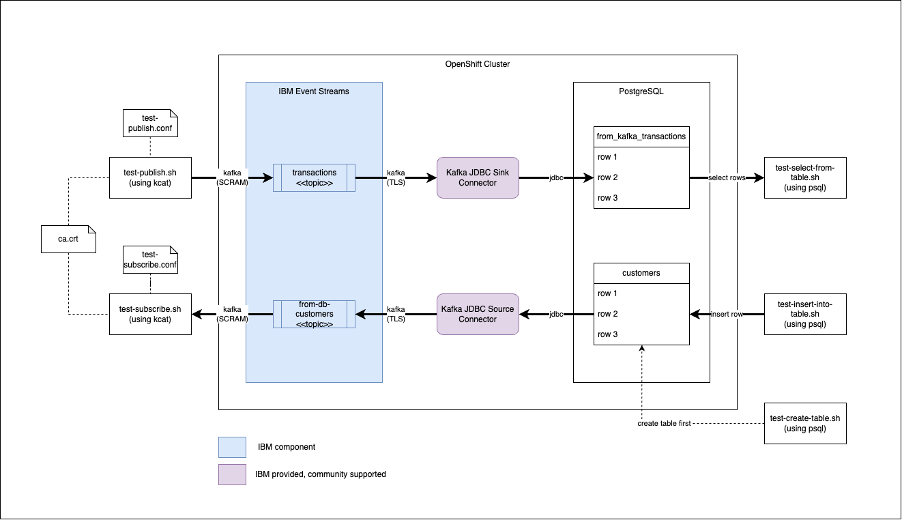

# Setup Kafka JDBC connectors (sink and source) between IBM Event Streams and PostgreSQL

## Test Scenario

The picture below shows:

- Kafka JDBC sink connector to receive events from a Kafka topic and insert records into a database table.

- Kafka JDBC source connector to send events to a Kafka topic everytime there are rows inserted into a database table.

  

## Prerequisites (tested)

1. OpenShift v4.15 (pre-installed)
1. Cloud Pak for Integration v16.1 (pre-installed)
1. Event Streams v3.4 (pre-installed)
1. PostgreSQL (installation [here](./postgres-install/README.md))
5. JDBC connect for Apache Kafka [here](https://github.com/Aiven-Open/jdbc-connector-for-apache-kafka/)

## Tools

1. oc cli
1. kcat - installation instructions found [here](https://github.com/edenhill/kcat)
1. podman [here](https://podman.io/docs/installation)
1. Java 11

## Build connector JAR files

1. Cloud the repository
    ```
    $ git clone https://github.com/Aiven-Open/jdbc-connector-for-apache-kafka.git
    ```

1. Build the connectors (required Java 11 installed)
    ```
    $ cd jdbc-connector-for-apache-kafka
    $ ./gradlew clean build

    BUILD SUCCESSFUL in 1m 11s
    15 actionable tasks: 14 executed, 1 up-to-date
    ```

1. The JAR files are found in `build/libs` folder
    ```
    $ tree build/libs
    build/libs
    ├── jdbc-connector-for-apache-kafka-6.11.0-SNAPSHOT-sources.jar
    └── jdbc-connector-for-apache-kafka-6.11.0-SNAPSHOT.jar
    ```

## Build Container Image for Connector

1. Create the Dockerfile. 
    ```
    FROM cp.icr.io/cp/ibm-eventstreams-kafka:11.4.0

    USER root

    COPY ./plugins/ /opt/kafka/plugins/

    RUN cd /opt/kafka/libs && curl -sO https://jdbc.postgresql.org/download/postgresql-42.7.3.jar

    USER 1001
    ```

1. Create a folder called `plugins` in the same directory where your Dockerfile is located and copy the connector JAR file to plugins/jdbc.
    ```
    $ cp -p ${jdbc-connector-for-apache-kafka}/build/lib/jdbc-connector-for-apache-kafka-6.10.0-SNAPSHOT.jar plugins/jdbc
    ```

1. Build the image.
    ```
    $ podman build -t jdbc-connector .
    ```

1. Check the build image.
    ```
    $ podman images

    REPOSITORY                           TAG         IMAGE ID      CREATED      SIZE
    localhost/jdbc-connector             latest      9b0b085fcb32  7 days ago   775 MB
    cp.icr.io/cp/ibm-eventstreams-kafka  11.4.0      e07ce0765712  5 weeks ago  774 MB
    ```

1. Push image to your image registry (I am using `quay.io`).
    ```
    $ podman login quay.io
    $ podman tag jdbc-connector quay.io/kskhong/jdbc-connector
    $ podman push quay.io/kskhong/jdbc-connector
    ```

1. If you have already deployed the image into OpenShift; but you need to update the image, you may need to do the following:
   ```
   -- Start a debug session on a node
   $ oc debug node/<node_name>
   
   -- List all images in CRI-O
   # crictl images
   
   -- Remove the image
   # crictl rmi quay.io/kskhong/jdbc-connector:11.4.0
   # crictl rmi quay.io/kskhong/jdbc-connector:latest

   --- Exit the debug session
   # exit
   ```

## Create image pull secret

1. Create a secret that contains the credentials to your image registry (my case is `quay.io`). Assume the namespace is `integration`.
  ```
  $ oc create secret docker-registry \
      --docker-server=quay.io \
      --docker-username=<username> \
      --docker-password=<password> \
      --docker-email=unused \
      --namespace=integration
      quay-pull-secret
  ```

## Create a TLS Kafka User for the connector

1. Use this `kafkauser-jdbc-connector.yaml` file.
   ```
   apiVersion: eventstreams.ibm.com/v1beta2
   kind: KafkaUser
   metadata:
     labels:
       app.kubernetes.io/instance: esminimal
       backup.eventstreams.ibm.com/component: kafkauser
       eventstreams.ibm.com/cluster: esminimal
     name: jdbc-connector
     namespace: integration
   spec:
     authentication:
       type: tls
     authorization:
       acls:
       - host: '*'
         operations:
         - Read
         - Write
         - Create
         resource:
           name: '*'
           patternType: literal
           type: topic
       - host: '*'
         operations:
         - Read
         - Alter
         resource:
           name: __schema_
           patternType: prefix
           type: topic
       - host: '*'
         operations:
         - Read
         resource:
           name: '*'
           patternType: literal
           type: group
       type: simple
   ```

1. Apply the YAML file.
   ```
   $ oc apply -f kafkauser-jdbc-connector.yaml
   ```

1. A secret is automatically generated; associated with the `KafkaUser` object (`jdbc-connector`). The secret (`jdbc-connector`) contains the key and certificates `user.crt`, `ca.crt` and `user.p12` used to connect to Event Streams (inside the cluster). 

## Deploy Kafka Connect

1. Find the name of the Event Streams instance (assume namespace installed on in `integration`).
   ```
   $ oc get eventstreams -n integration
   
   NAME        STATUS
   esminimal   Ready
   ```

1. Use the `kafkaconnect.yaml` file. Note that you may need to configure according to you own environment. 
   ```
   apiVersion: eventstreams.ibm.com/v1beta2
   kind: KafkaConnect
   metadata:
      name: jdbc-connector-cluster
      namespace: integration
      annotations:
        eventstreams.ibm.com/use-connector-resources: "true"
    spec:
      replicas: 3
      bootstrapServers: esminimal-kafka-bootstrap.integration.svc:9093
      image: quay.io/kskhong/jdbc-connector:latest
      imagePullPolicy: Always
      template:
        pod:
          imagePullSecrets:
            - name: quay-pull-secret
          metadata:
            annotations:
              eventstreams.production.type: CloudPakForIntegrationNonProduction
              productID: 2a79e49111f44ec3acd89608e56138f5
              productName: IBM Event Streams for Non Production
              productVersion: 11.4.0
              productMetric: VIRTUAL_PROCESSOR_CORE
              productChargedContainers: jdbc-connector-cluster-connect
              cloudpakId: c8b82d189e7545f0892db9ef2731b90d
              cloudpakName: IBM Cloud Pak for Integration
              productCloudpakRatio: "2:1"
      config:
        group.id: jdbc-connector-cluster
        offset.storage.topic: connect-cluster-offsets
        config.storage.topic: connect-cluster-configs
        status.storage.topic: connect-cluster-status
        config.storage.replication.factor: 3
        offset.storage.replication.factor: 3
        status.storage.replication.factor: 3
      tls:
        trustedCertificates:
          - secretName: esminimal-cluster-ca-cert
            certificate: ca.crt
      authentication:
        type: tls
        certificateAndKey:
          certificate: user.crt
          key: user.key
          secretName: jdbc-connector
    ```

  - Name: `jdbc-connector-cluster`
  - Namespace: `integration`
  - Instance name of Events Streams: `esminimal`
  - Image: `quay.io/kskhong/jdbc-connector:latest` (this is the location you have stored your image)
  - Pull secret name: `quay-pull-secret` (this is the pull secret to the image registry)
  - Secret of authentication: `jdbc-connector` (same name as the secret you have created previously)

1. Apply the YAML file.
   ```
   $ oc apply -f kafkaconnect.yaml
   ```

1. Check the status.
   ```
   $ oc get kafkaconnect -n integration
   
   NAME                     DESIRED REPLICAS   READY
   jdbc-connector-cluster   3                  True
   ```


## Deploy Kafka JDBC Source Connector

The Kafka JDBC Source connector is used to push message from a Database table to Kafka topic. On insert a new row in a table and event will be published to a Kafka topic.

1. Get the service for the PostgreSQL database.

   ```
   $ oc get svc -n postgresql
   
   NAME         TYPE       CLUSTER-IP     EXTERNAL-IP   PORT(S)          AGE
   postgresql   NodePort   172.30.60.59   <none>        5432:30851/TCP   3d2h
   ```
  
  Hence, the full hostname is `<service>.<namespace>.svc`, i.e. `postgresql.postgresql.svc`, and the port is `5432`.

1. Use the `kafkaconnector-jdbc-source.yaml` file.

   ```
   apiVersion: eventstreams.ibm.com/v1beta2
   kind: KafkaConnector
   metadata:
     name: jdbc-source
     namespace: integration
     labels:
       eventstreams.ibm.com/cluster: jdbc-connector-cluster
       backup.eventstreams.ibm.com/component: kafkaconnector
   spec:
     class: io.aiven.connect.jdbc.JdbcSourceConnector
     tasksMax: 1
     config:
       batch.max.rows: 1
       connection.url: jdbc:postgresql://postgresql.postgresql.svc:5432/demo
       connection.user: postgres
       connection.password: Password
       # schema.pattern: postgres
       topic.prefix: from-db-
       catalog.pattern : public
       table.whitelist: customers
       poll.interval.ms : 5000
       table.poll.interval.ms: 60000
       mode: incrementing
       incrementing.column.name: id
       validate.non.null: false
   ```

1. Apply the YAML file
   ```
   $ oc apply -f kafkaconnector-jdbc-source.yaml
   ```

1. Check the status.
   ```
   $ oc get kafkaconnector -n integration
   
   NAME          CLUSTER                  CONNECTOR CLASS                             MAX TASKS   READY
   jdbc-source   jdbc-connector-cluster   io.aiven.connect.jdbc.JdbcSourceConnector   1           True
   ```

## Deploy Kafka JDBC Sink Connector

The Kafka JDBC Sink connector is receive events from a Kafka topic and insert the message into a database table.

1. Get the service for the PostgreSQL database.

   ```
   $ oc get svc -n postgresql
   
   NAME         TYPE       CLUSTER-IP     EXTERNAL-IP   PORT(S)          AGE
   postgresql   NodePort   172.30.60.59   <none>        5432:30851/TCP   3d2h
   ```
  
  Hence, the full hostname is `<service>.<namespace>.svc`, i.e. `postgresql.postgresql.svc`, and the port is `5432`.

1. Use the `kafkaconnector-jdbc-sink.yaml` file.

   ```
   apiVersion: eventstreams.ibm.com/v1beta2
   kind: KafkaConnector
   metadata:
     name: jdbc-sink
     namespace: integration
     labels:
       eventstreams.ibm.com/cluster: jdbc-connector-cluster
       backup.eventstreams.ibm.com/component: kafkaconnector
   spec:
     class: io.aiven.connect.jdbc.JdbcSinkConnector
     tasksMax: 1
     config:
       batch.size: 3
       connection.url: jdbc:postgresql://postgresql.postgresql.svc:5432/demo
       connection.user: postgres
       connection.password: Password
       topics: transactions
       insert.mode: insert
       # insert.mode: upsert
       auto.create: true
       auto.evolve: true
       table.name.format: from_kafka_${topic}
       # pk.mode: none
       pk.mode: record_value
       pk.fields: id
       value.converter: org.apache.kafka.connect.json.JsonConverter
   ```

1. Apply the YAML file
   ```
   $ oc apply -f kafkaconnector-jdbc-sink.yaml
   ```

1. Check the status.
   ```
   $ oc get kafkaconnector -n integration

   NAME          CLUSTER                  CONNECTOR CLASS                             MAX TASKS   READY
   jdbc-sink     jdbc-connector-cluster   io.aiven.connect.jdbc.JdbcSinkConnector     1           True
   jdbc-source   jdbc-connector-cluster   io.aiven.connect.jdbc.JdbcSourceConnector   1           True
   ```

## Prepare for testing

1. You need to create a table called `customers`. Run this script [create-table.sh](./test/create-table.sh).
   ```
   $ ./create-table.sh
   ```
  where parameters are:
  - PG_TABLE_NAME: Name of the table to be created for Source. Default is `customers`.
  - PG_DATABASE_NAME: Database name. Default is `demo`.
  - PG_INSTANCE_NAME: Instance name of PostgreSQL database. Default is `postgresql`.
  - PG_NAMESPACE: Namespace where PostgreSQL database is installed. Default is `postgresql`.

1. You need to create a KafkaUser for `SCRAM-SHA-512` authentication (needed for external access). Use the `kafkausear-kafka-client` file.
   ```
   apiVersion: eventstreams.ibm.com/v1beta2
   kind: KafkaUser
   metadata:
     generation: 1
     labels:
       app.kubernetes.io/instance: esminimal
       backup.eventstreams.ibm.com/component: kafkauser
       eventstreams.ibm.com/cluster: esminimal
     name: kafka-client
     namespace: integration
   spec:
     authentication:
       type: scram-sha-512
     authorization:
       acls:
       - host: '*'
         operations:
         - Read
         - Write
         - Create
         resource:
           name: '*'
           patternType: literal
           type: topic
       - host: '*'
         operations:
         - Read
         - Alter
         resource:
           name: __schema_
           patternType: prefix
           type: topic
       - host: '*'
         operations:
         - Read
         resource:
           name: '*'
           patternType: literal
           type: group
       type: simple
   ```

1. A secret is automatically generated; associated with the `KafkaUser` object (`kafka-client`). The secret (`kafka-client`) contains user/password credentials for external authentication `password` and `sasl.jaas.config`.
   ```
   export ES_KAFKA_USERPASSWORD=`oc get secret -n $ES_NAMESPACE $ES_KAFKA_USER -ojson | jq -r '.data.password' | base64 -d`
   ```

1. You also need to need to download the `ca.crt` which can be found in the secret `esminimal-cluster-ca-cert` or `<ES_INSTANCE>-cluster-ca-cert`
   ```
   $ export CA_CRT=`oc get secret -n $ES_NAMESPACE $ES_INSTANCE-cluster-ca-cert -ojson | jq -r '.data."ca.crt"' | base64 -d`
   ```

1. Of course you will also need the BOOTSTRAP URL.
   ```
   $ export ES_BOOTSTRAP_HOST=`oc get route -n $ES_NAMESPACE $ES_INSTANCE-kafka-bootstrap -ojson | jq -r '.status.ingress[].host'`
   $ export ES_BOOTSTRAP_PORT=443
   ```

1. I have prepared the scripts in [test-publish.sh](./test/test-publish.sh) and [test-subscribe.sh](./test/test-subscribe.sh) to do all the above to simplify testing.

## Test Kafka JDBC Source Connector

1. Run the script [test-publish.sh](./test/test-publish.sh) to send a `transaction.json` to Kafka topic `transactions`. It will generate a configuration file `test-publish.conf` and a ca certification file `ca.crt`. It also keeps track of the offset in a file and generates a new ID for the transaction record because the database table needs a unique ID to be inserted.
   ```
   $ ./test-publish.sh <ES_TOPIC> <ES_KAFKA_USER> <ES_INSTANCE> <ES_NAMESPACE>
   ```
   where
   - ES_TOPIC: Topic to publish. Default is `transactions`.
   - ES_KAFKA_USER: Name of the KafkaUser to connect to Event Streams. Default is `kafka-client`.
   - ES_INSTANCE: Instance name of Event Streams. Default is `esminimal`.
   - ES_NAMESPACE: Namespace of Event Streams. Default is `integration`.

1. The expected result is a row inserted into the table `from_kafka_transactions` in the `demo` database. Run the scripts [test-select-from-table.sh](./test/test-select-from-table.sh) to select the record from the table. **(Note: You need to enter the database password.)**
   ```
   $ ./test-select-from-table.sh
   Password for user postgres: 
   id | account_no | trans_type | amount | currency 
   ----+------------+------------+--------+----------
   1 | 4444444    | Deposit    |   2900 | AUD
   (1 row)
   ```
   with following parameters:
   - PG_TABLE_NAME: Table name for customer. Default is `from_kafka_transactions`.
   - PG_DATABASE_NAME: Database name. Default is `demo`.
   - PG_INSTANCE_NAME: Instance name of PostgreSQL. Default is `postgresql`.
   - PG_NAMESPACE: Namespace where PostgreSQL is installed. Default is `postgresql`

## Test Kafka JDBC Sink Connector

1. Run the script [test-insert-into-table.sh](./test/test-insert-into-table.sh) to insert a row into the `customers` table in the `demo` database. Note you should be created the `customers` table using `create-table.sh`. **(Note: You need to enter the database password.)**
   ```
   $ ./test-insert-into-table.sh 
   Password for user postgres: 
   INSERT 0 1
   ```
   with following parameters:
   - CUSTOMER_NAME: Name of the customer.
   - CUSTOMER_AGE: Age of the customer.
   - CUSTOMER_PHONE: Phone number of the customer.
   - PG_TABLE_NAME: Table name for customer. Default is `customers`.
   - PG_DATABASE_NAME: Database name. Default is `demo`.
   - PG_INSTANCE_NAME: Instance name of PostgreSQL. Default is `postgresql`.
   - PG_NAMESPACE: Namespace where PostgreSQL is installed. Default is `postgresql`

1. The expected result is an event published to the Kafka topic `from-db-customers` in IBM Event Streams. Run the scripts [test-subscribe.sh](./test/test-subscribe.sh) to fetch the event from the topic. The script reads a single event and keeps track off the offset.
   ```
   $ ./test-subscribe.sh <ES_TOPIC> <ES_KAFKA_USER> <ES_INSTANCE> <ES_NAMESPACE>
   ```
   where
   - ES_TOPIC: Topic to publish. Default is `from-db-customers`.
   - ES_KAFKA_USER: Name of the KafkaUser to connect to Event Streams. Default is `kafka-client`.
   - ES_INSTANCE: Instance name of Event Streams. Default is `esminimal`.
   - ES_NAMESPACE: Namespace of Event Streams. Default is `integration`.

1. The output of the scripts is: 
   ```
   $ ./test-subscribe.sh
   customers.offset file found
   offset: 6
   % Reading configuration from file test-subscribe.conf
   % Reached end of topic from-db-customers [0] at offset 6
   {"schema":{"type":"struct","fields":[{"type":"int32",   "optional":false,"field":"id"},{"type":"string",   "optional":true,"field":"name"},{"type":"int32",   "optional":true,"field":"age"},{"type":"string",   "optional":true,"field":"phone"},{"type":"int64",   "optional":true,"name":"org.apache.kafka.connect.data.   Timestamp","version":1,"field":"created_at"},   {"type":"int64","optional":true,"name":"org.apache.kafka.   connect.data.Timestamp","version":1,   "field":"updated_at"}],"optional":false,   "name":"customers"},"payload":{"id":7,"name":"Peter    Parker","age":19,"phone":"96348373",   "created_at":1721570490025,"updated_at":1721570490025}}
   new offset: 7
   ```

## References

- [Kafka Connect Deep Dive – JDBC Source Connector](https://www.confluent.io/blog/kafka-connect-deep-dive-jdbc-source-connector/
)
- [Using the JDBC Source/Sink Connectors and Kafka Connect](https://ibmi-oss-docs.readthedocs.io/en/latest/kafka/KAFKA_CONNECT_JDBC.html)
- [Kafka Connect JDBC Source Connector](https://turkogluc.com/kafka-connect-jdbc-source-connector/)
- [Configure Kafka Connect JDBC as a Sink Connector](https://github.com/cloudant-labs/data-flow-examples/blob/master/ibm-event-streams/README.md#configure-kafka-connect-jdbc-as-a-sink-connector)
- [Kafka Connect JDBC Sink](https://github.com/ibm-messaging/kafka-connect-jdbc-sink)
- [Implement customer rewards system with IBM Event Streams](https://www.ibm.com/blog/implement-a-customer-rewards-system-with-ibm-event-streams/)
- [Source config options](https://docs.confluent.io/kafka-connectors/jdbc/current/source-connector/source_config_options.html)
- [Sink config options](https://docs.confluent.io/kafka-connectors/jdbc/current/sink-connector/sink_config_options.html)
- [Simplified with KCat](https://dev.to/sergiomarcial/kafka-simplified-with-kcat-kafka-cat-1gn7)